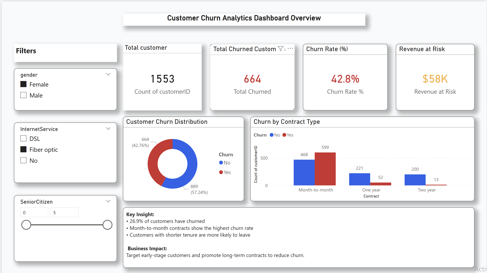
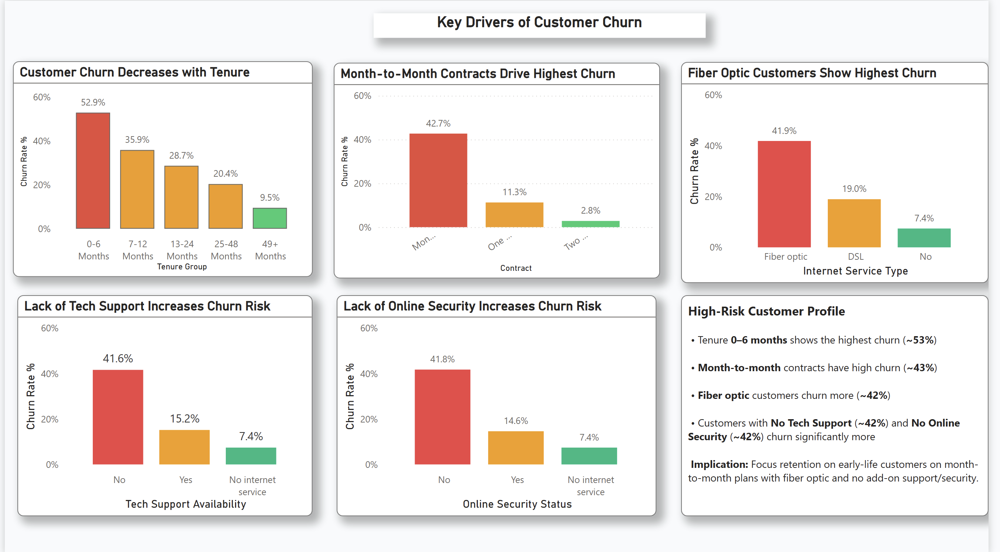
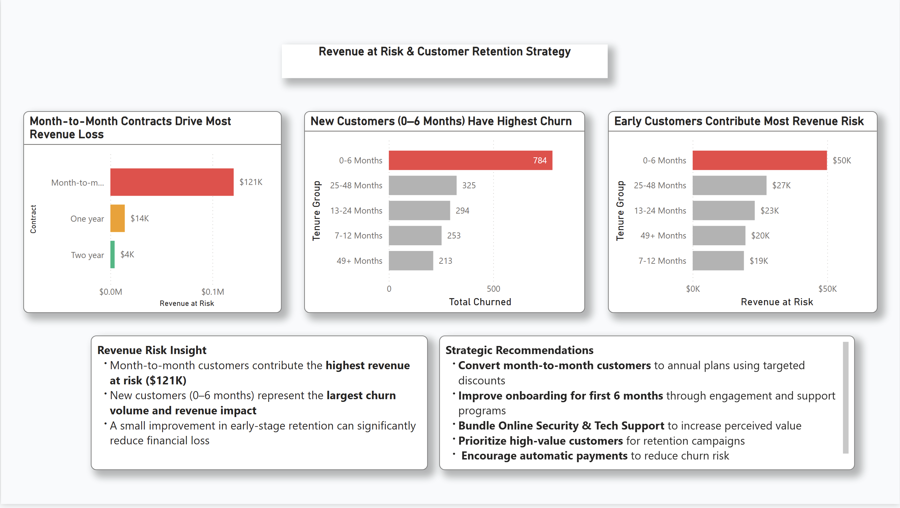
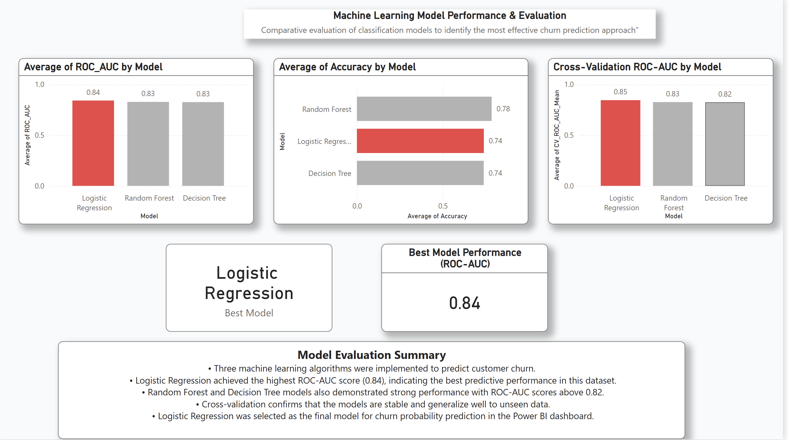

# 📊 Customer Churn Analytics (Power BI + Machine Learning)

---

## 🔹 Project Overview
This project analyzes customer churn in a telecom company using **data analytics and machine learning**.  
The goal is to identify key factors influencing churn and provide **actionable insights** to improve customer retention.

---

## 🔹 Tech Stack
- Python (Pandas, NumPy, Scikit-learn)
- Power BI
- Git & GitHub

---

## 🔹 Project Workflow
1. Data Cleaning & Preprocessing  
2. Feature Engineering  
3. Machine Learning Model (Logistic Regression)  
4. Model Evaluation  
5. Dashboard Visualization in Power BI  

---

## 🔹 Machine Learning Results
- Model: Logistic Regression  
- Accuracy: 82%  
- ROC-AUC Score: 0.85  

👉 The model effectively identifies customers with high churn probability.

---

## 🔹 Key Business Insights
- 📉 Month-to-month contract customers have higher churn  
- 💰 High monthly charges increase churn risk  
- 🛠 Customers without tech support are more likely to leave  
- 📊 Long-term customers are more stable  

---
- Month-to-month contract customers churn more
- Higher monthly charges increase churn
- Long-term customers are more stable

## 🔹 Dashboard Preview

### 📈 Key Drivers of customer churn

### 🔍 Revenue Risk and Retenion Strategy

### 📊 Machine Alogorithms

## 🔹 Business Impact
This project helps businesses:
- Identify high-risk customers  
- Improve retention strategies  
- Reduce revenue loss  

---

## 🔹 Repository Structure
churn-analytics/
│
├── data/
├── src/
│ ├── data_cleaning.py
│ ├── churn_model.py
│
├── powerbi/
│ └── screenshots/
│
├── outputs/
├── README.md
├── requirements.txt

---

## 🔹 Author
**Nency Anghan**  
Master of Software Engineering – New Zealand  
Aspiring Data Analyst  

---